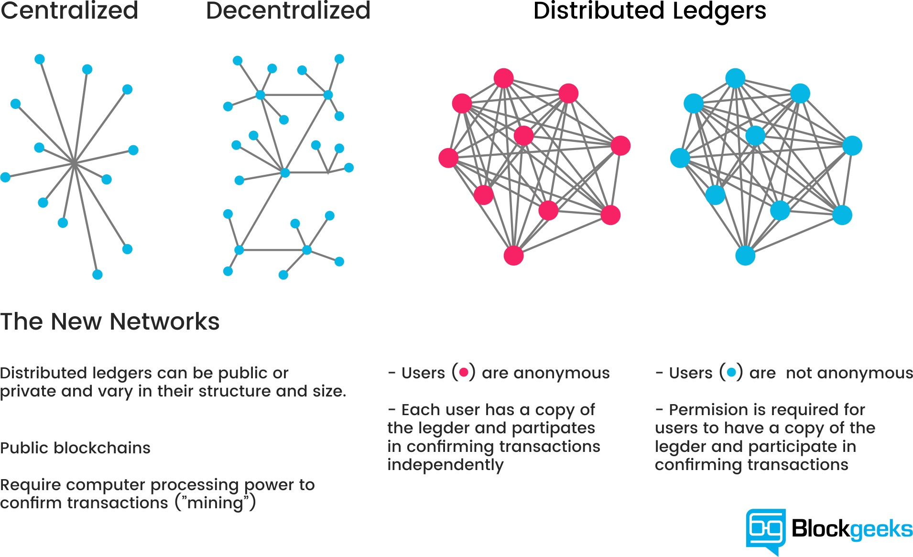
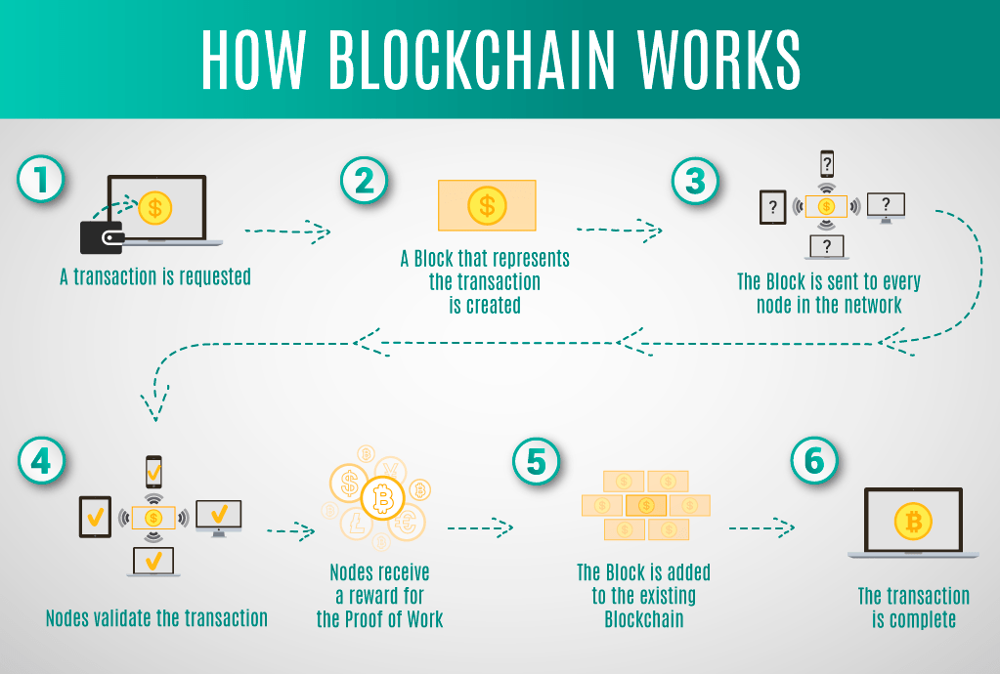
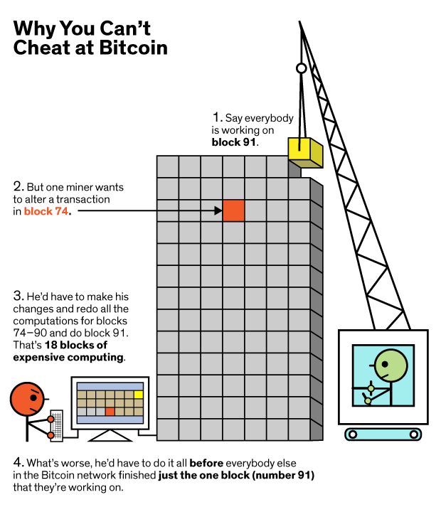

# Blockchain-Notes

[Lecture I](#Lecture-I)  
a. [Bitcoin](#Bitcoin)  
b. [What is a Blockchain](#What-is-a-Blockchain)  
c. [Consensus](#Consensus)  
d. [How does mining work?](#How-does-mining-work?)  
e. [Working with Blockchain](#Working-with-BlockChain)  
f. [Show the Chain](#Show-the-Chain)  
g. [Proof of Work](#Proof-of-Work)  
h. [Reward](#Reward)  
i. [Project Tips](#Project-Tips)  


<br>
<br>

[Lecture II](#Lecture-II)  

<br>
<br>

## Pre-Class Resources

[The Trust Machine: The History of Bitcoin](https://youtu.be/ZKwqNgG-Sv4) 

[2 Part Blockchain Demo & Explanation](https://anders.com/blockchain/)  

[Quick Read: Blockchain Explained Simply](https://gardenofcrypto.com/blog/blockchain-explained-simply)  

[Blockchain Project Repo](https://github.com/LambdaSchool/Blockchain)  

<br>
<br>

# Lecture I




<br>
<br>

## Bitcoin

#### Who is Satoshi Nakamoto?

Nobody knows!

While we don't know individually who or what Satoshi Nakamoto really is, it is the name used by the unknown person or persons who developed bitcoin, authored the bitcoin white paper, and created and deployed bitcoin's original reference implementation. As part of the implementation, they also devised the first blockchain database.  

<br>

Bitcoin is a cryptocurrency that allows us to prove that currency has not been double spent, created in 2008.  

Satoshi currently holds (supposedly) 1 million Bitcoin. As of July 10, 2019, the value of a single Bitcoin is roughly $12,300.  

<br>

We explored the basics of hashing and building hash tables to understand how they work. Hash tables were invented in the 1950's, so while it's an old computer science data structure, it's continually being used in new and unique ways that fundamentally shift how we use computing.  

Every time you use an object in modern languages, that is based on a hash table.  

<br>

Blockchain is another shift in computing that we don't yet understand the implications of.  

Blockchain is made up of nodes, which are a linked list of hash tables. Hashing is key to blockchain technology, as well as Proof of Work.

Bitcoin uses the HashCash Proof of Work system, invented in 1997 to prevent mail gateway abuse, spam, and domain squatting.  

<br>
<br>

## What is a Blockchain?

It's a chain of blocks, or a linked list. Each block contains a cryptographic hash of the previous block, a timestamp and transaction data.  

The _key_ part of blockchain is that it is immutable with reference to the preceding blocks.  

It contains an index, transactions (the data), timestamp, and hash of the previous block.  

<br>

  

  
<br>

When the first block is created, it contains data. The second block contains data and a hash of block one. Block three contains a hash of block two. And so on...   

If we try to change something in Block Two, the hash will be different from the stored Hash on Block Three, that references Block Two. In order to change one Block, you'd have to change all of the subsequent Blocks as well, because each modification would invalidate the stored Hash.  

In Bitcoin, value is created by requiring work -- made up problems that take a computer a long time to solve and immense amounts of electricity. This creates an "expense" for mining. The first person to solve this arbitrarily difficult problem is the one who mines the bitcoin.   

To offset the time required to solve these problems, people pool together to mine coins collectively.  

<br>
<br>

## Consensus

The Bitcoin Blockchain is public. Everyone has a copy of it and there's a network of nodes hosting a copy of it. The person with the longest chain has the "correct" chain -- the longest chain wins.  

<br>



<br>

To cheat the system in a brute force method, you'd have to not only change one block, but all the following blocks _before_ and new block is added to the chain. Due to the substantial computing power and electricity required for mining a single block, it's nearly impossible to attack so many at once.  

<br>
<br>

## How does mining work?

(This explanation from Investopedia)[https://www.investopedia.com/terms/b/bitcoin-mining.asp] is helpful:

<br>

>How Does Bitcoin Mining Work?  
>
>Here's the catch. In order for bitcoin miners to actually earn bitcoin from verifying transactions, two things have to occur. First, they must verify 1 megabyte (MB) worth of transactions, which can theoretically be as small as 1 transaction but are more often several thousand, depending on how much data each transaction stores. This is the easy part.
>
>Second, in order to add a block of transactions to the blockchain, miners must solve a complex computational math problem, also called a "proof of work." What they're actually doing is trying to come up with a 64-digit hexadecimal number, called a "hash," that is less than or equal to the target hash. Basically, a miner's computer spits out hashes at a rate of megahashes per second (MH/s), gigahashes per second (GH/s), or even terahashes per second (TH/s) depending on the unit, guessing all possible 64-digit numbers until they arrive at a solution. In other words, it's a gamble.
>
>The difficulty level of the most recent block at the time of writing is about 6,061,518,831,027. That is, the chance of a computer producing a hash below the target is 1 in 6,061,518,831,027 — less than 1 in 6 trillion. That level is adjusted every 2016 blocks, or roughly every 2 weeks, with the goal of keeping rates of mining constant. That is, the more miners competing for a solution, the more difficult the problem will become. The opposite is also true. If computational power is taken off of the network, the difficulty adjusts downward to make mining easier.

<br>
<br>


## Working with BlockChain  

Let's use our `blockchain.py` file from the [project repo](https://github.com/LambdaSchool/Blockchain) to start working with the concept of Blockchain.  

To open this file, we need to install our dependencies using `pipenv install` and start our `pipenv shell`. Now when we `python3 blockchain.py`, the terminal should read: 

<br>

```
 * Running on http://0.0.0.0:5000/ (Press CTRL+C to quit)
```

<br>

We're running (Flask)[https://en.wikipedia.org/wiki/Flask_(web_framework)], a simple web framework that calls a function when we hit a server endpoint. 

Since we're using a server, to check that it's live and working, we can use Postman to hit `http://localhost:5000/mine` with a GET request.

It returns:

<br>

```
<!DOCTYPE HTML PUBLIC "-//W3C//DTD HTML 3.2 Final//EN">
<title>500 Internal Server Error</title>
<h1>Internal Server Error</h1>
<p>The server encountered an internal error and was unable to complete your request. Either the server is overloaded or there is an error in the application.</p>
```

<br>

Which tells us that the server is live, but we need to change some code to get things running.

<br>

Our class Blockchain starts with:

```
class Blockchain(object):
    def __init__(self):
        self.chain = []
        self.current_transactions = []
        self.nodes = set()

        self.new_block(previous_hash=1, proof=99)
```

<br>

The nodes are the other servers running this same software with the same chain, so it's decentralized and no one entity holds control.  


`self.new_block(previous_hash=1, proof=100)` is initializing our blockchain with a Genesis Block.  

Our block used to create a new block is expected to be an object like so: 

<br>

```
block = {
    'index': len(self.chain) + 1,
    'timestamp': time(),
    'transactions': self.current_transactions,
    'proof': proof,
    'previous_hash': previous_hash or self.hash(self.chain[-1]),
}
```

<br>

New transation sets a new transaction to go into the next mined Block:

<br>

```
self.current_transactions.append({
            'sender': sender,
            'recipient': recipient,
            'amount': amount,
        })

        return self.last_block['index'] + 1
```

<br>

This appends a transaction and how people give money to one another inside of the immutable ledger. We can use this information throughout the blockchain to see who holds what money.

<br>

We also have a hash function:

<br>

```
        block_string = json.dumps(block, sort_keys=True).encode()
        return hashlib.sha256(block_string).hexdigest()
```

<br>

The next item is a decorator:

<br>

```
    @property
    def last_block(self):
        return self.chain[-1]
```

<br>

It wraps the function underneath `@property` with a decorator name so you can access it as a property of the class.

<br>

Next, we have:

<br>

```
def proof_of_work(self, last_proof):
    """
    Simple Proof of Work Algorithm
    - Find a number p' such that hash(pp') contains 4 leading
    zeroes, where p is the previous p'
    - p is the previous proof, and p' is the new proof
    """

    pass
```

<br>

This function does nothing and returns nothing, but has a description of what it's supposed to do. It's simply a marker of what we _will_ need but have not yet written.

The next decorator is for an also unwritten function: 

<br>

```
@staticmethod
def valid_proof(last_proof, proof):
    """
    Validates the Proof:  Does hash(last_proof, proof) contain 4
    leading zeroes?
    """
    # TODO
    pass
```

<br>

The next function has unwritten portions that we'll need to fill in:

<br>

```
    def valid_chain(self, chain):
        """
        Determine if a given blockchain is valid

        :param chain: <list> A blockchain
        :return: <bool> True if valid, False if not
        """

        last_block = chain[0]
        current_index = 1

        while current_index < len(chain):
            block = chain[current_index]
            print(f'{last_block}')
            print(f'{block}')
            print("\n-------------------\n")
            # Check that the hash of the block is correct
            # TODO: Return false if hash isn't correct

            # Check that the Proof of Work is correct
            # TODO: Return false if proof isn't correct

            last_block = block
            current_index += 1

        return True
```

<br>

How can we verify is a blockchain is valid?

We can check the hash of the previous block, or we can check the proof of work.  

It's easier to check that a solution of a proof of work is correct, than checking the hash of previous bloks -- despite it being expensive to _create_ the solution to the proof of work.  

<br>
<br>

## Show the Chain

Since we already have the Genesis Block, the first thing we should fill in what is currently in the chain so we can see the blockchain.

We need to compose a response in Python to visualize the chain: 

<br>

```
@app.route('/chain', methods=['GET'])
def full_chain():
    response = {
        # TODO: Return the chain and its current length
    }
    return jsonify(response), 200
```

<br>

`{ }` means this `response` will be a dictionary (hash table). 

<br>

```
@app.route('/chain', methods=['GET'])
def full_chain():
    response = {
        "currentChain": Blockchain.chain,
        "length": len(Blockchain.chain)
    }
    return jsonify(response), 200
```

<br>

We can test if it works by hitting the `/chain` endpoint in Postman to receive something back like this:

<br>

```
{
    "currentChain": [
        {
            "index": 1,
            "previous_hash": 1,
            "proof": 99,
            "timestamp": 1562781958.428834,
            "transactions": []
        }
    ],
    "length": 1
}
```

<br>

Next let's work on the proof of work.

<br>
<br>

## Proof of Work

```
    def proof_of_work(self, last_proof):
        """
        Simple Proof of Work Algorithm
        - Find a number p' such that hash(pp') contains 4 leading
        zeroes, where p is the previous p'
        - p is the previous proof, and p' is the new proof
        """
```

<br>
<br>

We'll start at 0. Proofs are integers, which we know because the Genesis Block has an integer and the parameter specs indicate so.

<br>

```
proof = 0
while self.valid_proof(last_proof, proof) is False:
    # while we have NOT found a solution, we'll try again
    proof += 1
# This loops exits when we have found a valid proof
return proof
```

<br>

This is easily written but requires us to write a good validation proof function:

<br>

```
    @staticmethod
    def valid_proof(last_proof, proof):
        """
        Validates the Proof:  Does hash(last_proof, proof) contain 4
        leading zeroes?
        """
        # TODO
        pass
```

<br>

We need to validate if our guess is correct -- the guess is a hash of last_proof and proof, appended together. We can use f strings to do that:

<br>

```
guess = f"{last_proof}{proof}"
```

<br>

We are going to use the `sha256` hash for this.

<br>

```
guess = f"{last_proof}{proof}".encode()
guess_hash = hashlib.sha256(guess).hexdigest()
```
<br>

_A good research question would be to learn more about how this works and we arrived at this solution._

How can we verify that the hash is functioning as expected?

We check if `guess_hash` contains 4 leading zeros. We can use shorthand to slice the first four array elements `[:4]` like so:

<br>

```
return guess_hash[:4] == "0000"
```

<br>

This returns a true/false boolean value depending on if it passes our proof of work.  

We can test this by commenting out the `response` object data and replacing it with proof:

<br>

```
def mine():
    # We run the proof of work algorithm to get the next proof...
    last_block = blockchain.last_block
    last_proof = last_block['proof']
    proof = blockchain.proof_of_work(last_proof)

    # We must receive a reward for finding the proof.
    # TODO:
    # The sender is "0" to signify that this node has mine a new coin
    # The recipient is the current node, it did the mining!
    # The amount is 1 coin as a reward for mining the next block

    # Forge the new Block by adding it to the chain
    # TODO

    # Send a response with the new block
    response = {
        # 'message': "New Block Forged",
        # 'index': block['index'],
        # 'transactions': block['transactions'],
        # 'proof': block['proof'],
        # 'previous_hash': block['previous_hash'],

        'proof': proof
    }
```

<br>

When we hit the /mine endpoint, it should return a successful number that passes our proof of work function.

<br>
<br>

## Reward

We need to fill in the mine function to receive reward for our proof of work. We can use the new transaction function already written to help:

```
# We must receive a reward for finding the proof.
# The sender is 0, the recipient is node_identifier, and the amount is 1
blockchain.new_transaction(0, node_identifier, 1)
```

<br>

We also have a function for creating a new block, with the proof having been defined in line 145: `proof = blockchain.proof_of_work(last_proof)`. We'll use the hashed last_block of the blockchain as the previous_hash parameter:

<br>

```
# Forge the new Block by adding it to the chain
block = blockchain.new_block(proof, blockchain.hash(last_block))
```

<br>

Remember, `new_block()` returns the newly created block so we can set the variable equal to the function call.

Now when we hit the `/mine` endpoint in postman, it shows a new block being forged.

<br>

```
{
    "index": 2,
    "message": "New Block Forged",
    "previous_hash": "c89e42365daa6bd6e08c31abf143568c9411079082d3dfdf2f7e9b0bdc4bbacb",
    "proof": 74581,
    "transactions": [
        {
            "amount": 1,
            "recipient": "9188a5b6107c40d3987d247a36023503",
            "sender": 0
        }
    ]
}
```

<br>

If we check the chain at `/chain`, we can see not just the blocks, but also the transactions that have happened within them.  

<br>

```
{
    "currentChain": [
        {
            "index": 1,
            "previous_hash": 1,
            "proof": 99,
            "timestamp": 1562782943.373497,
            "transactions": []
        },
        {
            "index": 2,
            "previous_hash": "c89e42365daa6bd6e08c31abf143568c9411079082d3dfdf2f7e9b0bdc4bbacb",
            "proof": 74581,
            "timestamp": 1562782953.784697,
            "transactions": [
                {
                    "amount": 1,
                    "recipient": "9188a5b6107c40d3987d247a36023503",
                    "sender": 0
                }
            ]
        }
    ],
    "length": 2
}
```

<br>

If we go to the `transactions/new` endpoint and POST the following object:

<br>

```
{
    "sender": "brian",
    "recipient": "bonder",
    "amount": 1000000
}
```

<br>

That will add a new transaction, as noted in the response: `"message": "Transaction will be added to Block 3"`.

If we `/mine` more blocks and look at the chain, we should be able to find that added transaction recorded.  

<br>

```
{
    "currentChain": [
        {
            "index": 1,
            "previous_hash": 1,
            "proof": 99,
            "timestamp": 1562782943.373497,
            "transactions": []
        },
        {
            "index": 2,
            "previous_hash": "c89e42365daa6bd6e08c31abf143568c9411079082d3dfdf2f7e9b0bdc4bbacb",
            "proof": 74581,
            "timestamp": 1562782953.784697,
            "transactions": [
                {
                    "amount": 1,
                    "recipient": "9188a5b6107c40d3987d247a36023503",
                    "sender": 0
                }
            ]
        },
        {
            "index": 3,
            "previous_hash": "c13fbbb5e6983425f3aee2d34b24d856e50616e797c058cf7a4cac6c39eef9b8",
            "proof": 28441,
            "timestamp": 1562783121.297569,
            "transactions": [
                {
                    "amount": 1000000,
                    "recipient": "bonder",
                    "sender": "brian"
                },
                {
                    "amount": 1,
                    "recipient": "9188a5b6107c40d3987d247a36023503",
                    "sender": 0
                }
            ]
        }
    ],
    "length": 3
}
```

<br>

Because of the chain of hashes, that transaction can't be changed or removed as long as there are enough nodes to keep the chain running in a decentralized manner, to verify any changes to the blockchain.

<br>

#### How does it know which block to place the transaction in?

The transactions are placed in a queue and added to the _next_ block that will be mined. The complexity of the proof of work problem to be solved to mine a new block is adjusted based on the number of people trying to mine, to ensure that it's difficult enough to have one block being mined roughly every ten minutes, so that transactiosn are recorded regularly.

<br>

_Unknown: How will that work in the case of there being a finite number of blocks that can be mined?_

_Research question: How are transactions handled? We won't go into this during these lectures but it is an equally complex and important topic to understanding Blockchain._

<br>
<br>

## Project Tips

The mining is done server side currently, so whenever we mine, the server is doing the problem solving, which isn't ideal.

We want clients to be able to mine by spending their own electricity and we'll reward them for doing that work for us by giving them a coin.

In the project repo, there is a `miner.py` ile and a `blockchain.py` file. The ReadMe goes over the necessary modifications:

<br>

Try to solve these problems without the help of present solutions for the following days. The process setup forces you to learn how to _build_ blockchain technology, with each day building upon the next.

<br>

_Side note: The project is setup to use port 5000 automatically, but it can also accept a port number after `python3 blockchain.py ----` to indicate the ideal port to run on_


To prevent having to restart your server manually with each file change, you can run this script in the terminal:

<br>

```
export FLASK_DEBUG=1
export FLASK_APP=name-of-your-python-file-here.py
flask run
```

<br>
<br>
<br>

# Lecture II


